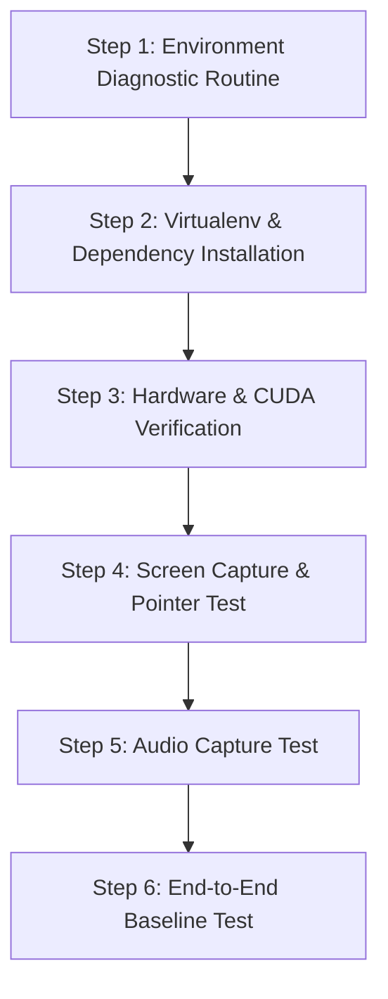

# Detailed Implementation Plan: Ikkhi

## 1. Executive Summary
This document provides the technical blueprint and implementation plan for **Ikkhi**, a voice-controlled Windows desktop assistant powered by local GPU speech recognition, a credit-optimized Google AI Studio integration, and a hybrid automation/pointing engine.

---

## 2. Technical Architecture & Component Design

### 2.1 Core Configuration (`core/config.py`)
- **Technology:** `pydantic-settings` + `pyyaml`
- **Specification:**
  - Loads default settings from `config.yaml` and environment overrides from `.env`.
  - Validates audio device index, sample rate (16kHz), Whisper compute type (`float16` for RTX 3070), and hotkey combos.

### 2.2 Audio Ingestion & Local STT (`audio/`)
- **Components:**
  - `hotkey_listener.py`: Global background listener using `pynput.keyboard` to detect Push-to-Talk (`Ctrl+Alt+Space` by default). Fires start/stop recording events asynchronously without blocking Windows message loops.
  - `recorder.py`: Ring buffer audio recorder using `sounddevice` capturing mono 16kHz audio.
  - `stt_engine.py`: Loads `faster-whisper` (`base.en` or `small.en`) onto the RTX 3070 via CUDA `float16`. Transcribes the recorded audio chunk in < 250ms.

### 2.3 Intent Router (`core/intent_router.py`)
- **Tier 0 (Local Fast-Path):**
  - Instant pattern matching (Compiled Regex + Fuzzy Token match).
  - Handles routine navigation: "play", "pause", "cut", "save", "volume up", "open terminal", "switch window".
  - Execution time: < 2ms, $0.00 cost, 0 API calls.
- **Tier 1 (Smart Cloud AI Fallback):**
  - Triggers only when no Tier 0 pattern matches, or when the query is explicitly conversational or visual ("What is this button?", "Explain this graph").
  - Hands off query and compressed screen crop to `ai_tier/gemini_client.py`.

### 2.4 Smart Screen Indexer & Token Optimizer (`vision/screen_indexer.py`)
- **Credit & Token Protection Algorithm:**
  1. Detect active window handle using `win32gui` / `pywinauto`.
  2. Crop strictly to active window bounding box (excludes second monitors, taskbars, and wallpaper).
  3. Downscale high-DPI image so max dimension is $\le$ 1024px.
  4. Perceptual hashing / frame diff: If screen has not changed since previous query, reuse cached layout.
  5. Encode as JPEG (80% quality), reducing token consumption by up to 75% compared to raw full-desktop screenshots.

### 2.5 Visual Cursor Pointer & Grounding (`vision/cursor_pointer.py`)
- **Features:**
  - Takes normalized coordinates `(x, y)` returned by Gemini or UI automation.
  - Translates normalized coordinates to absolute physical desktop pixel coordinates accounting for Windows DPI scaling.
  - Animates mouse cursor along a smooth cubic bezier / ease-out path over 300-400ms.
  - Creates a temporary, non-stealing semi-transparent highlight ring or subtle cursor wiggle to visually guide the user's attention.

### 2.6 Action Catalog (`actions/`)
- **Registry:** `@action` decorator registering function name, natural language description, and Pydantic argument model.
- **OS Actions:** Window snapping, minimize/maximize, volume control, media playback.
- **DaVinci Resolve Actions:** Play/stop, blade cut (`Ctrl+B`), ripple delete (`Shift+Backspace`), export, marker creation.

---

## 3. Implementation Plan Routine & Validation Matrix

### Validation Tests:
| Routine ID | Target Component | Success Criteria |
| :--- | :--- | :--- |
| `VAL-ENV-01` | Python & System | Python 3.10+ detected, Windows OS confirmed |
| `VAL-GPU-01` | NVIDIA RTX 3070 | CUDA available, compute capability verified |
| `VAL-SCR-01` | Screen Indexer | Window capture, crop, and resize functional without crash |
| `VAL-PTR-01` | Cursor Pointer | Cursor moves smoothly to target coordinate and returns |
| `VAL-AUD-01` | Audio Device | Default input device recognized and captures 16kHz audio |
| `VAL-ROU-01` | Intent Router | Local fast path matches 100% of standard commands in <5ms |

---

## 4. Risk Analysis & Mitigations

| Risk | Impact | Mitigation Strategy |
| :--- | :--- | :--- |
| **VRAM Contention with DaVinci Resolve** | DaVinci needs VRAM for 4K rendering; Whisper model could cause out-of-memory. | Use `faster-whisper` `base.en` with `float16` or `int8_float16`, taking only ~600MB VRAM. Unload model or fallback to CPU if VRAM > 90%. |
| **Excessive Gemini API Credit Usage** | Unwanted token drain from frequent queries. | Hard requirement: Local Fast-Path resolves all standard macros. Screen captures are cropped, compressed, and capped at max 1 request per voice trigger. |
| **Windows DPI Scaling Misalignment** | High-DPI screens (e.g. 125%, 150%) cause cursor to point at incorrect location. | Use Windows `SetProcessDpiAwarenessContext` in Python to get true hardware pixel coordinates. |
