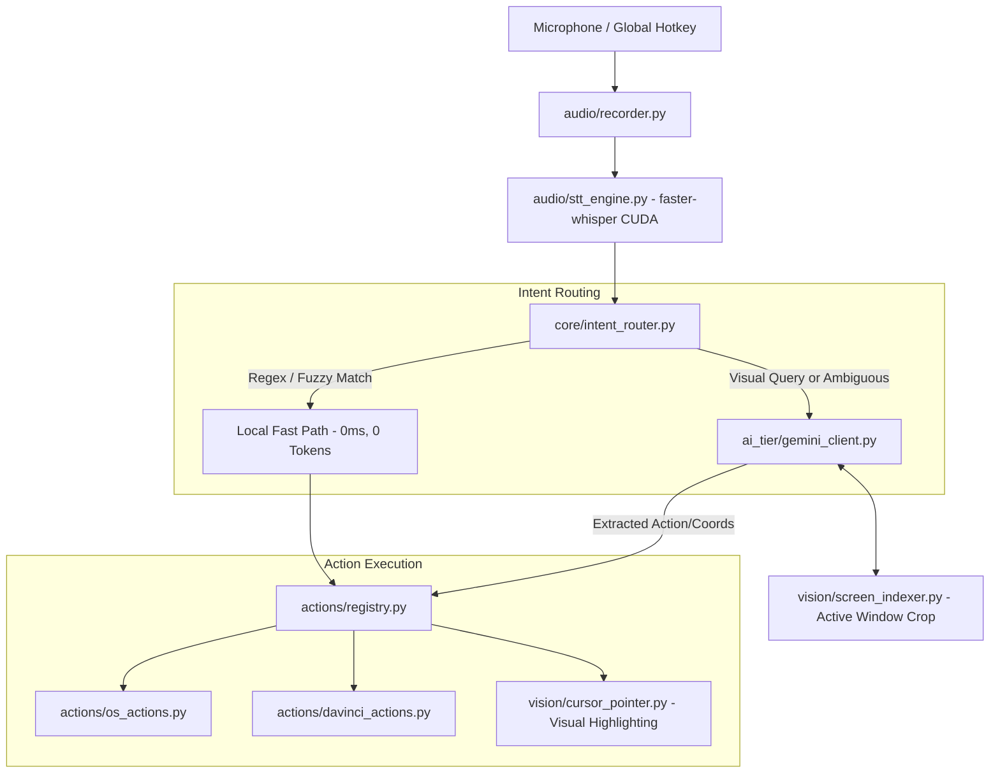

# Project Map & Architectural Layout: Ikkhi

This document maps out the structural layout, module dependencies, file responsibilities, and data flow across the Ikkhi codebase. It must be updated whenever files are added, restructured, or deprecated.

---

## 1. Directory Tree & File Inventory

```
e:/rouf/software-project/Ikkhi/
│
├── .agents/                                # Agent skills & workflow customizations
│   └── skills/
│       ├── ikkhi-automation/
│       │   └── SKILL.md                    # Action registration & tier hierarchy cheat sheet
│       └── ikkhi-security/
│           └── SKILL.md                    # Defensive hardening & vulnerability audit protocols
│
├── AGENTS.md                               # System directives, agent persona, and rules
├── BOUNDARIES.md                           # Hard safety boundaries, privacy, and token cost rules
├── CONTEXT.md                              # Ultra-compact AI agent handoff snapshot (<100 lines)
├── CONVERSATION_SUMMARY.md                 # Living log of conversation decisions & requirements
├── EXISTING_SOLUTIONS.md                   # Comparative analysis of Talon, Microsoft UFO, etc.
├── IMPLEMENTATION_PLAN.md                  # Detailed phase-by-phase implementation plan
├── PROGRESS.md                             # Live project schedule, milestone checklist & status
├── PROJECT_GOALS.md                        # Vision, architecture pillars, and roadmap
├── PROJECT_MAP.md                          # (This file) Complete codebase & module map
│
├── docs/                                   # Research, deconstruction & planning artifacts
│   ├── CLICKY_ANALYSIS.md                  # In-depth architectural deconstruction of HeyClicky
│   ├── GUI_AND_PACKAGING_PLAN.md           # Standalone GUI & single-file executable master plan
│   ├── COMPACT_CONTEXT_PLAN.md             # Implementation plan for compact agent context engine
│   └── CREATIVE_APPS_AND_EXPERIENCE_PLAN.md# Universal creative apps & experiential mistake learning
│
├── pyproject.toml                          # PEP 621 compliant package build & metadata
├── requirements.txt                        # Core Python runtime dependencies
├── config.yaml                             # Central configuration (audio, AI tiers, pointer)
├── Ikkhi.spec                              # PyInstaller standalone executable bundling specification
├── .env.example                            # Environment variables template (API keys, hotkeys)
├── .gitignore                              # Comprehensive Python & OS ignore rules
├── README.md                               # Enterprise documentation & quickstart
│
├── src/                                    # Standard PEP 517/621 src-layout
│   └── ikkhi/                              # Core application package
│       ├── __init__.py                     # Package version and export definitions
│       ├── __main__.py                     # Universal entry point (GUI / Headless / CLI modes)
│       ├── py.typed                        # PEP 561 static typing marker
│       ├── core/                           # System orchestration and routing
│       │   ├── __init__.py
│       │   ├── paths.py                    # Cross-platform frozen & runtime path resolver
│       │   ├── exceptions.py               # Domain-specific error hierarchies
│       │   ├── config.py                   # Pydantic Settings configuration loader
│       │   ├── router.py                   # High-throughput Tier 0 vs Tier 1 intent router
│       │   └── orchestrator.py             # Event loop coordinator
│       ├── audio/                          # Audio capture, VAD, local STT and TTS
│       │   ├── __init__.py
│       │   ├── capture.py                  # Zero-copy 16kHz audio buffer capture engine (sounddevice)
│       │   ├── hotkey.py                   # Global asynchronous push-to-talk listener (pynput)
│       │   ├── stt.py                      # Local faster-whisper CUDA transcription engine
│       │   └── tts.py                      # 100% offline, zero-token local speech synthesis
│       ├── vision/                         # Visual indexing, multi-monitor, and cursor guidance
│       │   ├── __init__.py
│       │   ├── monitors.py                 # Multi-monitor topology & DPI normalizer
│       │   ├── indexer.py                  # Active window cropper and token compressor
│       │   └── pointer.py                  # DPI-aware smooth cursor glide & visual pulse
│       ├── automation/                     # Universal & deterministic automation
│       │   ├── __init__.py
│       │   ├── registry.py                 # Action catalog decorator and argument validator
│       │   ├── inspector.py                # Universal Windows UIA inspector (any foreground window)
│       │   ├── profiles.py                 # Persistent per-app learning profiles (JSON storage)
│       │   ├── experience.py               # Bayesian experiential memory & mistake learning engine
│       │   ├── universal.py                # Universal dynamic execution engine
│       │   ├── windows.py                  # Windows OS volume and window controls
│       │   ├── creative/                   # Universal creative application suite adapters
│       │   │   ├── __init__.py
│       │   │   └── catalog.py              # DaVinci, Premiere, Blender, Photoshop, Ableton, etc.
│       │   └── apps/
│       │       ├── __init__.py
│       │       └── davinci.py              # DaVinci Resolve legacy macro hooks
│       ├── ai/                             # Multimodal AI tier
│       │   ├── __init__.py
│       │   └── gemini.py                   # Token-conscious Google AI Studio client
│       └── ui/                             # Desktop Graphical User Interface
│           ├── __init__.py                 # UI component exports
│           ├── theme.py                    # Obsidian dark-mode stylesheet & design tokens
│           ├── overlay.py                  # Floating frameless companion HUD & waveform
│           ├── tray.py                     # Windows Shell notification tray icon & menu
│           ├── dashboard.py                # Token analytics, metrics cards & settings panel
│           ├── controller.py               # Asynchronous QThread audio inference controller
│           └── app.py                      # Master Qt application coordinator
│
├── storage/                                # [Runtime] Persistent application knowledge
│   └── profiles/                           # Per-application JSON control maps & learned macros
│
├── tests/                                  # Comprehensive test suite (39 automated tests)
│   ├── __init__.py
│   ├── unit/                               # Isolated unit tests
│   │   ├── __init__.py
│   │   ├── test_audio.py                   # Audio buffer and hotkey tests
│   │   ├── test_config.py                  # Configuration loader tests
│   │   ├── test_context.py                 # Compact context snapshot boundedness & coverage
│   │   ├── test_creative.py                # Universal creative app catalog & shortcut resolution
│   │   ├── test_experience.py              # Bayesian experiential memory & mistake learning tests
│   │   ├── test_monitors.py                # Multi-monitor enumeration tests
│   │   ├── test_router.py                  # Intent classification & routing tests
│   │   ├── test_security.py                # Defensive hardening & path traversal tests
│   │   ├── test_speech.py                  # Speech synthesis lifecycle tests
│   │   ├── test_ui.py                      # GUI widgets, tray, overlay & path resolver tests
│   │   └── test_universal.py               # Universal inspector & adaptive profile tests
│   └── integration/                        # Master end-to-end integration tests
│       ├── __init__.py
│       └── test_full_system.py             # 8-stage comprehensive subsystem verification
│
└── scripts/                                # Maintenance & diagnostic routines
    ├── validate_environment.py             # System & hardware validation routine
    ├── test_live_voice.py                  # Interactive microphone & voice verification tool
    └── build_executable.py                 # PyInstaller single-file binary compilation pipeline
```

---

## 2. Module Flow & Dependency Graph



---

## 3. Component Responsibility Matrix

| Module | Primary Responsibility | Dependencies | Cost / Resource Footprint |
| :--- | :--- | :--- | :--- |
| `core/config.py` | Load and validate `config.yaml` and `.env` | `pydantic`, `pyyaml` | ~0ms, zero overhead |
| `audio/hotkey_listener.py` | Detect Push-to-Talk activation without blocking | `pynput` | 0% CPU idle |
| `audio/stt_engine.py` | Transcribe speech locally on RTX 3070 | `faster-whisper`, `CUDA` | ~150-300ms, 1GB VRAM |
| `core/intent_router.py` | Route intent: Local regex first, Cloud second | Python standard library | <1ms |
| `ai_tier/gemini_client.py` | Answer visual queries & parse screen coordinates | `google-genai` | Strictly on-demand, tokens minimized |
| `vision/screen_indexer.py` | Crop active window, compress, cache | `PIL`, `pywinauto` | Minimal RAM, <20ms |
| `vision/cursor_pointer.py` | Smoothly glide cursor to target & flash visual cue | `pyautogui` | Zero network overhead |
| `actions/registry.py` | Dispatch verified parameters to deterministic functions | Python standard library | Deterministic, safe |
