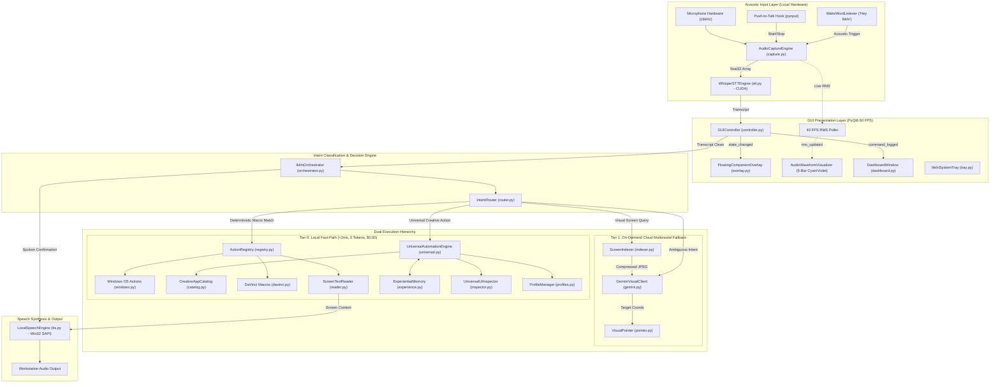

# Ikkhi Master Project Map & Architectural Connectivity Dossier

> **Authoritative Codebase Specification:** This document is the canonical Master Map for **Ikkhi** (ইক্ষি). It maps the directory topology, module responsibilities, bidirectional connection pathways (inbound callers and outbound dependencies), interfaces, and resource budgets across the entire project.
> 
> Governed by the [`ikkhi-map`](file:///e:/rouf/software-project/Ikkhi/.agents/skills/ikkhi-map/SKILL.md) skill. Maintained continuously upon every code modification.

---

## 1. Directory Tree & Comprehensive File Inventory

```
e:/rouf/software-project/Ikkhi/
│
├── .agents/                                # Custom agent skill workflows & behavioral protocols
│   └── skills/
│       ├── ikkhi-automation/               # Hybrid UIA & deterministic action registration
│       │   └── SKILL.md
│       ├── ikkhi-security/                 # Threat modeling, path traversal & injection guards
│       │   └── SKILL.md
│       ├── ikkhi-ui/                       # Autonomous UI engineering & design token governance
│       │   └── SKILL.md
│       └── ikkhi-map/                      # Master project map maintenance & connection schema
│           └── SKILL.md
│
├── docs/                                   # Architectural research, plans & comparative studies
│   ├── CLICKY_ANALYSIS.md                  # Deconstruction of HeyClicky strengths & weaknesses
│   ├── COMPACT_CONTEXT_PLAN.md             # Architecture of ultra-compact agent context snapshot
│   ├── COMPARISON_OPENCLAW.md              # Comparative analysis: Ikkhi vs OpenClaw
│   ├── CREATIVE_APPS_AND_EXPERIENCE_PLAN.md# Universal creative apps & Bayesian mistake learning
│   ├── DEEPSEEK_AND_AGENT_INNOVATIONS.md   # DeepSeek MLA, MoE, Code-as-Action & local agent models
│   └── GUI_AND_PACKAGING_PLAN.md           # Standalone GUI & single-file binary packaging plan
│
├── src/                                    # Canonical PEP 517/621 src-layout
│   └── ikkhi/                              # Root application package
│       ├── __init__.py                     # Package version & metadata
│       ├── __main__.py                     # Universal CLI/GUI/Daemon bootstrap router
│       ├── py.typed                        # PEP 561 static typing compliance marker
│       │
│       ├── core/                           # System foundation, configuration & routing
│       │   ├── __init__.py
│       │   ├── config.py                   # Pydantic Settings & dynamic .env secret loader
│       │   ├── exceptions.py               # Domain-specific typed exception hierarchy
│       │   ├── paths.py                    # Frozen PyInstaller bundle & persistent path resolver
│       │   ├── router.py                   # High-throughput Tier 0 vs Tier 1 intent classifier
│       │   └── orchestrator.py             # Event coordinator & execution dispatcher
│       │
│       ├── audio/                          # Acoustic capture, neural STT, TTS & wake-word
│       │   ├── __init__.py
│       │   ├── capture.py                  # Zero-copy 16kHz audio buffer capture (sounddevice)
│       │   ├── hotkey.py                   # Global asynchronous push-to-talk listener (pynput)
│       │   ├── stt.py                      # Local faster-whisper CUDA GPU transcription engine
│       │   ├── tts.py                      # 100% offline local Win32 SAPI speech synthesis
│       │   └── wakeword.py                 # Low-overhead acoustic wake-word spotter ("Hey Ikkhi")
│       │
│       ├── vision/                         # Multi-monitor management, screen indexing & cursor
│       │   ├── __init__.py
│       │   ├── monitors.py                 # Virtual multi-display topology & DPI normalizer
│       │   ├── indexer.py                  # Active window cropper & token downsampling indexer
│       │   └── pointer.py                  # DPI-aware bezier cursor glide & visual circle pulse
│       │
│       ├── automation/                     # Deterministic macros, dynamic UIA & experiential learning
│       │   ├── __init__.py
│       │   ├── registry.py                 # Deterministic action decorator & parameter validator
│       │   ├── inspector.py                # Universal Windows UIA accessibility tree inspector
│       │   ├── reader.py                   # Screen text-to-speech & clipboard accessibility reader
│       │   ├── profiles.py                 # Persistent per-app learning profiles (JSON store)
│       │   ├── experience.py               # Bayesian experiential memory & mistake learning engine
│       │   ├── universal.py                # Universal dynamic UI execution & fallback engine
│       │   ├── windows.py                  # Windows OS volume, media, and window controls
│       │   ├── apps/                       # Dedicated application macro hooks
│       │   │   ├── __init__.py
│       │   │   └── davinci.py              # DaVinci Resolve specialized video editing macros
│       │   └── creative/                   # Cross-application creative suite catalog
│       │       ├── __init__.py
│       │       └── catalog.py              # Premiere, Blender, Photoshop, Figma, Ableton, etc.
│       │
│       ├── ai/                             # Multimodal cloud AI tier
│       │   ├── __init__.py
│       │   └── gemini.py                   # Token-conscious Google AI Studio visual client
│       │
│       └── ui/                             # Standalone desktop graphical user interface
│           ├── __init__.py
│           ├── theme.py                    # Obsidian dark-mode stylesheet & design tokens
│           ├── overlay.py                  # Frameless companion HUD pill & reactive RMS waveform
│           ├── tray.py                     # Windows Shell notification tray icon & context menu
│           ├── dashboard.py                # Token analytics, metrics cards & settings panel
│           ├── controller.py               # Asynchronous QThread audio inference worker & RMS timer
│           └── app.py                      # Master Qt application coordinator & window manager
│
├── tests/                                  # Comprehensive automated test suite (46 tests)
│   ├── __init__.py
│   ├── integration/                        # End-to-end integration tests
│   │   ├── __init__.py
│   │   └── test_full_system.py             # 8-stage comprehensive subsystem integration test
│   └── unit/                               # Isolated unit tests
│       ├── __init__.py
│       ├── test_audio.py                   # Audio buffer and hotkey listener verification
│       ├── test_config.py                  # Configuration loader & .env parsing verification
│       ├── test_context.py                 # Compact context snapshot boundedness & coverage
│       ├── test_creative.py                # Universal creative app catalog & shortcut tests
│       ├── test_experience.py              # Bayesian experiential memory & mistake learning tests
│       ├── test_monitors.py                # Multi-monitor enumeration & normalization tests
│       ├── test_reader.py                  # Screen reading & text-to-speech routing tests
│       ├── test_router.py                  # Intent classification & routing tests
│       ├── test_security.py                # Defensive hardening & path traversal tests
│       ├── test_speech.py                  # Speech synthesis lifecycle tests
│       ├── test_ui.py                      # GUI widgets, tray, overlay & settings tests
│       └── test_universal.py               # Universal inspector & adaptive profile tests
│
├── scripts/                                # Maintenance, build & diagnostic routines
│   ├── build_executable.py                 # PyInstaller single-file binary compilation script
│   ├── test_live_gui.py                    # Interactive visual GUI companion test launcher
│   ├── test_live_voice.py                  # Interactive microphone & voice verification tool
│   ├── test_live_wakeword.py               # Headless console wake-word & STT test script
│   └── validate_environment.py             # Host environment & GPU hardware validator
│
├── storage/                                # Persistent application knowledge (Git-ignored)
│   ├── profiles/                           # Per-application JSON control maps & learned macros
│   └── live_test.log                       # Live session audio and inference telemetry log
│
├── AGENTS.md                               # System directives, agent persona, and rules
├── BOUNDARIES.md                           # Hard safety boundaries, privacy, and token cost rules
├── CONTEXT.md                              # Ultra-compact AI agent handoff snapshot (<100 lines)
├── CONVERSATION_SUMMARY.md                 # Living log of conversation decisions & requirements
├── EXISTING_SOLUTIONS.md                   # Comparative analysis of Talon, Microsoft UFO, etc.
├── IMPLEMENTATION_PLAN.md                  # Detailed phase-by-phase implementation plan
├── PROGRESS.md                             # Live project schedule, milestone checklist & status
├── PROJECT_GOALS.md                        # Vision, architecture pillars, and roadmap
├── PROJECT_MAP.md                          # (This file) Authoritative Master Project Map
├── README.md                               # Enterprise documentation, quickstart & open-source credits
├── config.yaml                             # Central configuration (audio, AI tiers, pointer)
├── pyproject.toml                          # PEP 621 compliant package build & metadata
├── requirements.txt                        # Core Python runtime dependencies
├── Ikkhi.spec                              # PyInstaller standalone executable bundling specification
├── .env                                    # Local private credentials (Git-ignored)
├── .env.example                            # Public configuration template
└── .gitignore                              # Comprehensive Python, OS & secret ignore rules
```

---

## 2. Comprehensive Folder-by-Folder & File-by-File Dossier

### 📁 `.agents/skills/` — Custom Agent Skills & Governance
- **Domain / Job:** Machine-actionable agent skill protocols defining how AI assistants must interact with, secure, design, and document Ikkhi.
- **Parent / Inbound Callers:** Antigravity AI Agent runtime, LLM reasoning engines.
- **Submodules & Children:** `ikkhi-automation/`, `ikkhi-security/`, `ikkhi-ui/`, `ikkhi-map/`.

#### 📄 [`.agents/skills/ikkhi-automation/SKILL.md`](file:///e:/rouf/software-project/Ikkhi/.agents/skills/ikkhi-automation/SKILL.md)
- **Job / Core Duty:** Instructions for registering new voice commands, extending deterministic Python actions, and operating the hybrid UI automation stack (UIA $\rightarrow$ Hotkeys $\rightarrow$ CV).
- **Inbound Connections:** AI agents creating new automation functions or adding creative application macros.
- **Outbound Connections:** References `src/ikkhi/automation/registry.py`, `src/ikkhi/automation/universal.py`.
- **Key Interfaces:** Skill metadata, action registration conventions, UI automation hierarchy guidelines.
- **Resource Profile:** Meta-documentation (0 runtime tokens).

#### 📄 [`.agents/skills/ikkhi-security/SKILL.md`](file:///e:/rouf/software-project/Ikkhi/.agents/skills/ikkhi-security/SKILL.md)
- **Job / Core Duty:** Defensive security protocols, threat modeling rules, path traversal auditing checklists, and software hardening standards.
- **Inbound Connections:** AI agents conducting code reviews, modifying storage handlers, or updating configuration loaders.
- **Outbound Connections:** Governs `src/ikkhi/automation/profiles.py`, `src/ikkhi/core/config.py`.
- **Key Interfaces:** Path sanitization checklists, token exfiltration prevention rules.
- **Resource Profile:** Meta-documentation (0 runtime tokens).

#### 📄 [`.agents/skills/ikkhi-ui/SKILL.md`](file:///e:/rouf/software-project/Ikkhi/.agents/skills/ikkhi-ui/SKILL.md)
- **Job / Core Duty:** Design tokens, elevation hierarchies, double-buffered anti-aliasing paint rules, and autonomous polishing checklists inspired by Cloudflare, Apple, Google, Microsoft Fluent 2, and OpenClaw.
- **Inbound Connections:** AI agents modifying GUI widgets, stylesheets, waveforms, or tray menus.
- **Outbound Connections:** Governs `src/ikkhi/ui/theme.py`, `src/ikkhi/ui/overlay.py`, `src/ikkhi/ui/dashboard.py`.
- **Key Interfaces:** Token dictionary (`#07090e`, `#00e5ff`, `#a855f7`), 60 FPS event loop guarantees, non-intrusive focus rules.
- **Resource Profile:** Meta-documentation (0 runtime tokens).

#### 📄 [`.agents/skills/ikkhi-map/SKILL.md`](file:///e:/rouf/software-project/Ikkhi/.agents/skills/ikkhi-map/SKILL.md)
- **Job / Core Duty:** Master Project Map governance protocol dictating naming schemes, file dossier schemas, and mandatory autonomous synchronization triggers.
- **Inbound Connections:** AI agents completing features, modifying $\ge 3$ files, or restructuring directories.
- **Outbound Connections:** Governs [`PROJECT_MAP.md`](file:///e:/rouf/software-project/Ikkhi/PROJECT_MAP.md), [`CONTEXT.md`](file:///e:/rouf/software-project/Ikkhi/CONTEXT.md).
- **Key Interfaces:** Mandatory dossier templates, verification checklists, update triggers.
- **Resource Profile:** Meta-documentation (0 runtime tokens).

---

### 📁 `src/ikkhi/core/` — System Foundation, Configuration & Orchestration
- **Domain / Job:** The core nervous system of Ikkhi; manages runtime configuration, paths, typed errors, intent classification, and the central execution pipeline.
- **Parent / Inbound Callers:** `src/ikkhi/__main__.py`, `src/ikkhi/ui/controller.py`, `scripts/`, `tests/`.
- **Submodules & Children:** `config.py`, `paths.py`, `exceptions.py`, `router.py`, `orchestrator.py`.

#### 📄 [`src/ikkhi/core/config.py`](file:///e:/rouf/software-project/Ikkhi/src/ikkhi/core/config.py)
- **Job / Core Duty:** Strongly typed Pydantic Settings management; loads `config.yaml` and dynamically overlays `.env` secrets without exposing credentials in Git.
- **Inbound Connections:** Imported by `orchestrator.py`, `stt.py`, `capture.py`, `dashboard.py`, `controller.py`, `__main__.py`, all unit/integration tests.
- **Outbound Connections:** `pydantic`, `pydantic_settings`, `dotenv` (`load_dotenv`), `yaml`.
- **Key Interfaces:** `AppConfig`, `SystemSettings`, `NetworkSettings`, `AudioSettings`, `AITierSettings`, `ScreenIndexingSettings`, `PointerSettings`, `UniversalAutomationSettings`.
- **Resource Profile:** Startup execution (<2ms, 0 tokens, $0.00).

#### 📄 [`src/ikkhi/core/paths.py`](file:///e:/rouf/software-project/Ikkhi/src/ikkhi/core/paths.py)
- **Job / Core Duty:** Cross-platform path resolver for PyInstaller frozen single-binary environments (`sys._MEIPASS`) and development source trees; resolves `%APPDATA%/Ikkhi` storage paths.
- **Inbound Connections:** `dashboard.py`, `profiles.py`, `app.py`, `test_ui.py`.
- **Outbound Connections:** `pathlib.Path`, `os`, `sys`.
- **Key Interfaces:** `is_frozen()`, `get_bundle_dir()`, `get_storage_dir()`, `get_profiles_dir()`, `resolve_config_path()`.
- **Resource Profile:** In-memory string/path operations (<0.1ms).

#### 📄 [`src/ikkhi/core/exceptions.py`](file:///e:/rouf/software-project/Ikkhi/src/ikkhi/core/exceptions.py)
- **Job / Core Duty:** Domain-specific typed exception classes ensuring consistent error handling and diagnostic reporting across all subsystems.
- **Inbound Connections:** `capture.py`, `stt.py`, `tts.py`, `inspector.py`, `profiles.py`, `universal.py`.
- **Outbound Connections:** Python standard library `Exception`.
- **Key Interfaces:** `IkkhiError`, `AudioDeviceError`, `SpeechRecognitionError`, `AutomationExecutionError`, `ScreenCaptureError`.
- **Resource Profile:** Zero overhead.

#### 📄 [`src/ikkhi/core/router.py`](file:///e:/rouf/software-project/Ikkhi/src/ikkhi/core/router.py)
- **Job / Core Duty:** Ultra-fast deterministic intent classifier; routes spoken transcripts to Tier 0 local actions (<2ms, 0 tokens) or flags ambiguous/visual requests for Tier 1 cloud fallback.
- **Inbound Connections:** `orchestrator.py`, `controller.py`, `test_router.py`, `test_full_system.py`.
- **Outbound Connections:** `re` (regex matching).
- **Key Interfaces:** `IntentRouter`, `RouteDecision`, `route(transcript: str) -> RouteDecision`.
- **Resource Profile:** Sub-millisecond CPU regex evaluation (<1ms, 0 tokens, $0.00).

#### 📄 [`src/ikkhi/core/orchestrator.py`](file:///e:/rouf/software-project/Ikkhi/src/ikkhi/core/orchestrator.py)
- **Job / Core Duty:** Master event coordinator; receives user transcripts, queries the router, dispatches execution to deterministic actions, universal automation, or Gemini, and speaks results aloud.
- **Inbound Connections:** `__main__.py` (headless daemon), `controller.py` (GUI worker), `test_full_system.py`.
- **Outbound Connections:** `src/ikkhi/core/router.py`, `src/ikkhi/audio/tts.py`, `src/ikkhi/automation/registry.py`, `src/ikkhi/automation/universal.py`, `src/ikkhi/automation/reader.py`, `src/ikkhi/ai/gemini.py`, `src/ikkhi/vision/indexer.py`, `src/ikkhi/vision/pointer.py`.
- **Key Interfaces:** `IkkhiOrchestrator`, `process_transcript(transcript: str) -> str`.
- **Resource Profile:** End-to-end coordinator; local paths cost $0.00, cloud fallback invoked strictly on-demand.

---

### 📁 `src/ikkhi/audio/` — Acoustic Capture, Local STT, TTS & Wake-Word
- **Domain / Job:** 100% offline acoustic speech processing; provides zero-copy microphone buffers, global hotkey hooks, CUDA-accelerated Whisper STT, local Win32 speech synthesis, and acoustic wake-word spotting.
- **Parent / Inbound Callers:** `src/ikkhi/ui/controller.py`, `src/ikkhi/__main__.py`, `scripts/`, `tests/`.
- **Submodules & Children:** `capture.py`, `hotkey.py`, `stt.py`, `tts.py`, `wakeword.py`.

#### 📄 [`src/ikkhi/audio/capture.py`](file:///e:/rouf/software-project/Ikkhi/src/ikkhi/audio/capture.py)
- **Job / Core Duty:** Asynchronous zero-copy 16kHz mono audio stream capture from workstation microphone into contiguous NumPy float32 arrays; computes real-time RMS amplitude.
- **Inbound Connections:** `controller.py`, `__main__.py`, `test_live_voice.py`, `test_audio.py`.
- **Outbound Connections:** `sounddevice`, `numpy`, `queue`.
- **Key Interfaces:** `AudioCaptureEngine`, `start_recording()`, `stop_recording() -> np.ndarray`, `get_live_rms() -> float`.
- **Resource Profile:** Memory buffer queue, <0.5% CPU during recording.

#### 📄 [`src/ikkhi/audio/hotkey.py`](file:///e:/rouf/software-project/Ikkhi/src/ikkhi/audio/hotkey.py)
- **Job / Core Duty:** Low-overhead global Push-to-Talk keyboard hook (<kbd>Ctrl</kbd> + <kbd>Alt</kbd> + <kbd>Space</kbd>) operating asynchronously without blocking foreground applications.
- **Inbound Connections:** `controller.py`, `__main__.py`, `test_audio.py`.
- **Outbound Connections:** `pynput.keyboard`.
- **Key Interfaces:** `PushToTalkListener`, `start()`, `stop()`.
- **Resource Profile:** Background event listener (practically 0.0% CPU at idle).

#### 📄 [`src/ikkhi/audio/stt.py`](file:///e:/rouf/software-project/Ikkhi/src/ikkhi/audio/stt.py)
- **Job / Core Duty:** Private GPU-accelerated speech-to-text using `faster-whisper` (CTranslate2) on NVIDIA CUDA cores (float16); transcodes audio to English text in <250ms with zero cloud exposure.
- **Inbound Connections:** `controller.py`, `wakeword.py`, `__main__.py`, `test_full_system.py`.
- **Outbound Connections:** `faster_whisper.WhisperModel`, `numpy`.
- **Key Interfaces:** `WhisperSTTEngine`, `load_model()`, `transcribe(audio_array: np.ndarray) -> Tuple[str, float]`.
- **Resource Profile:** ~450MB VRAM on RTX 3070; sub-250ms inference latency; 0 API tokens ($0.00).

#### 📄 [`src/ikkhi/audio/tts.py`](file:///e:/rouf/software-project/Ikkhi/src/ikkhi/audio/tts.py)
- **Job / Core Duty:** Local, zero-token speech synthesis utilizing native Windows SAPI COM interfaces; delivers instant vocal confirmations without cloud synthesis delays or costs.
- **Inbound Connections:** `orchestrator.py`, `reader.py`, `controller.py`, `test_speech.py`.
- **Outbound Connections:** `win32com.client` (`SAPI.SpVoice`).
- **Key Interfaces:** `LocalSpeechEngine`, `speak(text: str, wait: bool = False)`, `stop()`.
- **Resource Profile:** Native OS COM object (<15ms latency, 0 tokens, $0.00).

#### 📄 [`src/ikkhi/audio/wakeword.py`](file:///e:/rouf/software-project/Ikkhi/src/ikkhi/audio/wakeword.py)
- **Job / Core Duty:** Continuous background acoustic wake-word listener scanning for "Hey Ikkhi" and phonetic variants using RMS energy gating and acoustic verification with <1% CPU footprint.
- **Inbound Connections:** `controller.py`, `__main__.py`, `test_live_wakeword.py`.
- **Outbound Connections:** `sounddevice`, `numpy`, `src/ikkhi/audio/stt.py`.
- **Key Interfaces:** `WakeWordListener`, `start()`, `stop()`, `trigger_manual(phrase: str)`.
- **Resource Profile:** Low-power acoustic stream (<1.0% CPU idle).

---

### 📁 `src/ikkhi/vision/` — Multi-Monitor, Screen Indexing & Cursor Guidance
- **Domain / Job:** Visual perception, multi-display geometry normalization, token-conscious screen downsampling, and smooth physical mouse cursor guidance.
- **Parent / Inbound Callers:** `orchestrator.py`, `universal.py`, `test_monitors.py`.
- **Submodules & Children:** `monitors.py`, `indexer.py`, `pointer.py`.

#### 📄 [`src/ikkhi/vision/monitors.py`](file:///e:/rouf/software-project/Ikkhi/src/ikkhi/vision/monitors.py)
- **Job / Core Duty:** Enumerates connected physical monitors via Win32 API, calculates virtual desktop bounding boxes, and normalizes normalized coordinates (0.0 to 1.0) into physical pixel space.
- **Inbound Connections:** `pointer.py`, `indexer.py`, `test_monitors.py`.
- **Outbound Connections:** `win32api`, `win32gui`, `win32con`.
- **Key Interfaces:** `MonitorManager`, `DisplayInfo`, `get_all_monitors()`, `normalize_coordinates()`.
- **Resource Profile:** Win32 system query (<1ms).

#### 📄 [`src/ikkhi/vision/indexer.py`](file:///e:/rouf/software-project/Ikkhi/src/ikkhi/vision/indexer.py)
- **Job / Core Duty:** Captures and crops the active foreground window, compresses images (JPEG quality 80, max 1024px dimension), and caches representations to minimize token consumption when querying Gemini.
- **Inbound Connections:** `orchestrator.py`, `gemini.py`, `test_reader.py`.
- **Outbound Connections:** `PIL.Image`, `pyautogui`, `io.BytesIO`.
- **Key Interfaces:** `ScreenIndexer`, `IndexedScreen`, `capture_active_window() -> IndexedScreen`.
- **Resource Profile:** In-memory compression (<20ms, reduces token payload by >75%).

#### 📄 [`src/ikkhi/vision/pointer.py`](file:///e:/rouf/software-project/Ikkhi/src/ikkhi/vision/pointer.py)
- **Job / Core Duty:** Glides the mouse cursor to target UI coordinates using smooth cubic bezier easing and flashes a transparent highlight circle to guide user attention.
- **Inbound Connections:** `orchestrator.py`, `universal.py`.
- **Outbound Connections:** `pyautogui`, `src/ikkhi/vision/monitors.py`.
- **Key Interfaces:** `VisualPointer`, `point_to(x: int, y: int, duration: float = 0.35)`.
- **Resource Profile:** Local OS cursor movement; zero external network calls.

---

### 📁 `src/ikkhi/automation/` — Deterministic Macros, Universal UIA & Experiential Learning
- **Domain / Job:** The action execution backbone; bridges registered deterministic shortcuts, universal Windows accessibility tree inspection, experiential mistake learning, and screen reading aloud.
- **Parent / Inbound Callers:** `orchestrator.py`, `controller.py`, `tests/`.
- **Submodules & Children:** `registry.py`, `inspector.py`, `reader.py`, `profiles.py`, `experience.py`, `universal.py`, `windows.py`, `creative/`, `apps/`.

#### 📄 [`src/ikkhi/automation/registry.py`](file:///e:/rouf/software-project/Ikkhi/src/ikkhi/automation/registry.py)
- **Job / Core Duty:** Master registry decorator (`@register_action`) validating function signatures, parameter types, and dispatching verified deterministic actions.
- **Inbound Connections:** `orchestrator.py`, `windows.py`, `davinci.py`, `universal.py`.
- **Outbound Connections:** Python standard library `inspect`, `functools`.
- **Key Interfaces:** `ActionRegistry`, `register_action(name: str)`, `execute(name: str, **kwargs) -> Any`.
- **Resource Profile:** Deterministic dictionary dispatch (<0.1ms).

#### 📄 [`src/ikkhi/automation/inspector.py`](file:///e:/rouf/software-project/Ikkhi/src/ikkhi/automation/inspector.py)
- **Job / Core Duty:** Traverses the Windows UI Automation (UIA) accessibility tree of any foreground application (DaVinci, Blender, Chrome, VS Code) extracting interactable buttons, menus, and coordinates.
- **Inbound Connections:** `universal.py`, `profiles.py`, `test_universal.py`.
- **Outbound Connections:** `pywinauto.uia_element_info.UIAElementInfo`, `uiautomation`.
- **Key Interfaces:** `UniversalUIInspector`, `UIElementDescriptor`, `inspect_active_window(depth: int = 4) -> List[UIElementDescriptor]`.
- **Resource Profile:** Local Win32 accessibility IPC (sub-50ms tree traversal).

#### 📄 [`src/ikkhi/automation/reader.py`](file:///e:/rouf/software-project/Ikkhi/src/ikkhi/automation/reader.py)
- **Job / Core Duty:** Reads text on the screen aloud using zero-token local speech synthesis; captures selected text via non-destructive clipboard operations or traverses UIA `TextPattern`/`ValuePattern`.
- **Inbound Connections:** `orchestrator.py`, `test_reader.py`.
- **Outbound Connections:** `src/ikkhi/audio/tts.py`, `pywinauto`, `pyperclip`, `pyautogui`.
- **Key Interfaces:** `ScreenTextReader`, `read_selection_or_window() -> str`.
- **Resource Profile:** 100% offline, zero-token local speech readout ($0.00).

#### 📄 [`src/ikkhi/automation/profiles.py`](file:///e:/rouf/software-project/Ikkhi/src/ikkhi/automation/profiles.py)
- **Job / Core Duty:** Manages persistent JSON profile storage (`storage/profiles/`) caching learned UI control positions per application; enforces strict path traversal mitigation.
- **Inbound Connections:** `universal.py`, `dashboard.py`, `test_security.py`.
- **Outbound Connections:** `json`, `pathlib.Path`, `src/ikkhi/core/paths.py`.
- **Key Interfaces:** `ProfileManager`, `AppProfile`, `get_or_create_profile(app_id: str)`, `save_profile(profile: AppProfile)`.
- **Resource Profile:** Local disk cache; prevents redundant UIA tree traversals.

#### 📄 [`src/ikkhi/automation/experience.py`](file:///e:/rouf/software-project/Ikkhi/src/ikkhi/automation/experience.py)
- **Job / Core Duty:** Bayesian experiential memory engine; tracks success/failure statistics for UI automation strategies, applies negative penalties upon user correction ("no", "wrong", "undo"), and computes Laplace-smoothed confidence scores.
- **Inbound Connections:** `universal.py`, `test_experience.py`.
- **Outbound Connections:** `dataclasses`, `json`, `pathlib.Path`.
- **Key Interfaces:** `ExperientialMemory`, `StrategyStats`, `ActionOutcome`, `record_outcome()`, `get_confidence_score()`, `apply_user_correction()`.
- **Resource Profile:** Lightweight Bayesian math (<1ms in-memory update).

#### 📄 [`src/ikkhi/automation/universal.py`](file:///e:/rouf/software-project/Ikkhi/src/ikkhi/automation/universal.py)
- **Job / Core Duty:** Universal adaptive automation engine; orchestrates multi-tier execution across creative shortcuts, cached profile controls, dynamic UIA inspection, and visual click execution.
- **Inbound Connections:** `orchestrator.py`, `test_universal.py`, `test_full_system.py`.
- **Outbound Connections:** `inspector.py`, `profiles.py`, `experience.py`, `catalog.py`, `pointer.py`.
- **Key Interfaces:** `UniversalAutomationEngine`, `execute_intent(intent: str) -> bool`.
- **Resource Profile:** Tier 0 local execution (<50ms, 0 tokens, $0.00).

#### 📄 [`src/ikkhi/automation/windows.py`](file:///e:/rouf/software-project/Ikkhi/src/ikkhi/automation/windows.py)
- **Job / Core Duty:** Registers native Windows OS control macros (volume up/down/mute, play/pause media, window minimize/maximize/snap).
- **Inbound Connections:** Registered via `registry.py`, invoked by `orchestrator.py`.
- **Outbound Connections:** `pyautogui`, `ctypes`, `win32gui`, `win32con`.
- **Key Interfaces:** `@register_action("volume_up")`, `@register_action("volume_down")`, `@register_action("minimize_window")`.
- **Resource Profile:** Instant Win32 virtual key dispatch (<1ms).

#### 📄 [`src/ikkhi/automation/creative/catalog.py`](file:///e:/rouf/software-project/Ikkhi/src/ikkhi/automation/creative/catalog.py)
- **Job / Core Duty:** Comprehensive cross-app creative shortcut matrix mapping creative intents to native shortcuts for DaVinci Resolve, Premiere Pro, Blender, Photoshop, After Effects, Figma, Ableton Live, and VS Code.
- **Inbound Connections:** `universal.py`, `test_creative.py`.
- **Outbound Connections:** Python standard library `dataclasses`.
- **Key Interfaces:** `CreativeAppCatalog`, `CreativeIntent`, `get_shortcut_for_active_app(process_name: str, intent: str) -> Optional[str]`.
- **Resource Profile:** Constant-time hash map lookup (<0.1ms).

#### 📄 [`src/ikkhi/automation/apps/davinci.py`](file:///e:/rouf/software-project/Ikkhi/src/ikkhi/automation/apps/davinci.py)
- **Job / Core Duty:** Specialized video editing macros for DaVinci Resolve (blade cut `Ctrl+B`, ripple delete, timeline zoom, render shortcut).
- **Inbound Connections:** Registered via `registry.py`, invoked by `orchestrator.py`.
- **Outbound Connections:** `pyautogui`.
- **Key Interfaces:** `@register_action("davinci_blade_cut")`, `@register_action("davinci_ripple_delete")`.
- **Resource Profile:** Instant deterministic keystroke dispatch (<2ms).

---

### 📁 `src/ikkhi/ai/` — Multimodal Cloud AI Tier
- **Domain / Job:** Strictly on-demand cloud intelligence invoked only when local deterministic and UIA tiers cannot resolve an ambiguous intent or unindexed visual coordinate.
- **Parent / Inbound Callers:** `orchestrator.py`.
- **Submodules & Children:** `gemini.py`.

#### 📄 [`src/ikkhi/ai/gemini.py`](file:///e:/rouf/software-project/Ikkhi/src/ikkhi/ai/gemini.py)
- **Job / Core Duty:** Credit-optimized Google AI Studio client; sends compressed active window crops to `gemini-2.0-flash` with strict token budgeting (max 350 tokens, temperature 0.1) returning normalized target coordinates and concise answers.
- **Inbound Connections:** `orchestrator.py`, `test_full_system.py`.
- **Outbound Connections:** `google.genai` (`genai.Client`, `types`), `json`, `src/ikkhi/vision/indexer.py`.
- **Key Interfaces:** `GeminiVisualClient`, `VisualQueryResult`, `query_visual_target(prompt: str, screen: IndexedScreen) -> VisualQueryResult`.
- **Resource Profile:** Strictly on-demand; budgeted payload (<1,800 input tokens, max 350 output tokens).

---

### 📁 `src/ikkhi/ui/` — Standalone Desktop Graphical User Interface
- **Domain / Job:** Graphical presentation layer; delivers a frameless translucent floating companion HUD pill with reactive audio waveforms, Windows Shell tray applet, and dark-mode settings/token analytics dashboard.
- **Parent / Inbound Callers:** `src/ikkhi/__main__.py`, `scripts/test_live_gui.py`.
- **Submodules & Children:** `theme.py`, `overlay.py`, `tray.py`, `dashboard.py`, `controller.py`, `app.py`.

#### 📄 [`src/ikkhi/ui/theme.py`](file:///e:/rouf/software-project/Ikkhi/src/ikkhi/ui/theme.py)
- **Job / Core Duty:** Design tokens, obsidian dark-mode stylesheet (`DARK_THEME_QSS`), typography stacks, glassmorphic card classes, and tactile keycap badge styles.
- **Inbound Connections:** `overlay.py`, `dashboard.py`, `app.py`, `test_ui.py`.
- **Outbound Connections:** PyQt6 Qt Style Sheets (QSS).
- **Key Interfaces:** `DARK_THEME_QSS`, palette tokens (`#07090e`, `#0d121d`, `#00e5ff`, `#a855f7`, `#10b981`).
- **Resource Profile:** Static QSS stylesheet string.

#### 📄 [`src/ikkhi/ui/overlay.py`](file:///e:/rouf/software-project/Ikkhi/src/ikkhi/ui/overlay.py)
- **Job / Core Duty:** Frameless, translucent, always-on-top companion HUD pill widget (`Qt.WindowType.Tool`) that never steals window focus; contains glowing monogram, title, subtitle, indeterminate progress bar, and reactive multi-bar audio waveform.
- **Inbound Connections:** `app.py`, `test_ui.py`.
- **Outbound Connections:** `PyQt6.QtWidgets`, `PyQt6.QtGui`, `PyQt6.QtCore`, `src/ikkhi/ui/theme.py`.
- **Key Interfaces:** `FloatingCompanionOverlay`, `AudioWaveformVisualizer`, `set_state(state: str, detail: str)`, `update_rms(level: float)`.
- **Resource Profile:** Double-buffered anti-aliased custom painting (60 FPS, <1% GPU usage).

#### 📄 [`src/ikkhi/ui/tray.py`](file:///e:/rouf/software-project/Ikkhi/src/ikkhi/ui/tray.py)
- **Job / Core Duty:** Windows Shell system notification tray icon with vector monogram ("ই"), dynamic context menu (Show HUD, Open Dashboard, Mute Microphone, Exit), and native balloon notifications.
- **Inbound Connections:** `app.py`, `test_ui.py`.
- **Outbound Connections:** `PyQt6.QtWidgets.QSystemTrayIcon`, `PyQt6.QtGui.QPainter`.
- **Key Interfaces:** `IkkhiSystemTray`, `generate_procedural_icon(size: int = 48) -> QIcon`, `notify(title: str, msg: str)`.
- **Resource Profile:** Native Windows Shell tray handle.

#### 📄 [`src/ikkhi/ui/dashboard.py`](file:///e:/rouf/software-project/Ikkhi/src/ikkhi/ui/dashboard.py)
- **Job / Core Duty:** Administration and Token Economy Analytics Dashboard; visualizes saved tokens, API cost offsets, live command streams, learned application profiles, and provides hardware/settings configuration.
- **Inbound Connections:** `app.py`, `test_ui.py`.
- **Outbound Connections:** `PyQt6.QtWidgets`, `src/ikkhi/automation/profiles.py`, `src/ikkhi/core/config.py`.
- **Key Interfaces:** `DashboardWindow`, `MetricCard`, `log_command(timestamp, utterance, tier, response)`, `refresh_profiles_list()`.
- **Resource Profile:** Standard Qt window with virtual table scrolling.

#### 📄 [`src/ikkhi/ui/controller.py`](file:///e:/rouf/software-project/Ikkhi/src/ikkhi/ui/controller.py)
- **Job / Core Duty:** Asynchronous controller bridging hardware listeners with Qt GUI; runs Whisper GPU transcription in a dedicated `QThread` (`AudioInferenceWorker`) and streams real-time microphone RMS volume via a 40 FPS timer.
- **Inbound Connections:** `app.py`.
- **Outbound Connections:** `PyQt6.QtCore.QThread`, `src/ikkhi/audio/capture.py`, `src/ikkhi/audio/stt.py`, `src/ikkhi/audio/hotkey.py`, `src/ikkhi/audio/wakeword.py`, `src/ikkhi/core/orchestrator.py`.
- **Key Interfaces:** `GUIController`, `AudioInferenceWorker`, `state_changed`, `rms_updated`, `command_logged`, `start_listeners()`, `stop_listeners()`.
- **Resource Profile:** Non-blocking async worker; guarantees uncompromised 60 FPS GUI responsiveness.

#### 📄 [`src/ikkhi/ui/app.py`](file:///e:/rouf/software-project/Ikkhi/src/ikkhi/ui/app.py)
- **Job / Core Duty:** Master Qt Application Coordinator; manages application lifecycle, positions the HUD overlay at the top-center of the primary monitor, and wires type-safe signals between controller, overlay, dashboard, and tray.
- **Inbound Connections:** `__main__.py`, `scripts/test_live_gui.py`.
- **Outbound Connections:** `PyQt6.QtWidgets.QApplication`, `controller.py`, `overlay.py`, `dashboard.py`, `tray.py`.
- **Key Interfaces:** `IkkhiApplication`, `launch_gui(config: Optional[AppConfig]) -> int`, `start()`, `shutdown()`.
- **Resource Profile:** Main Qt event loop coordinator.

---

### 📁 Root Application Entrypoints & Metadata
- **Domain / Job:** Application entrypoints and distribution markers.

#### 📄 [`src/ikkhi/__main__.py`](file:///e:/rouf/software-project/Ikkhi/src/ikkhi/__main__.py)
- **Job / Core Duty:** Universal application bootstrap router; inspects CLI flags to route execution to Desktop GUI mode (default), Headless Daemon (`--headless`), or CLI Command Simulation (`--cli`).
- **Inbound Connections:** Invoked by `python -m ikkhi`, `Ikkhi.exe`, `launch_ikkhi.bat`.
- **Outbound Connections:** `src/ikkhi/ui/app.py`, `src/ikkhi/core/orchestrator.py`, `src/ikkhi/core/config.py`.
- **Key Interfaces:** `main()`, `run_headless_daemon()`.
- **Resource Profile:** Lightweight CLI entrypoint.

#### 📄 [`src/ikkhi/__init__.py`](file:///e:/rouf/software-project/Ikkhi/src/ikkhi/__init__.py)
- **Job / Core Duty:** Root package declaration exporting `__version__ = "0.1.0"` and package docstring.
- **Inbound Connections:** Python package discovery.
- **Key Interfaces:** `__version__`.

#### 📄 [`src/ikkhi/py.typed`](file:///e:/rouf/software-project/Ikkhi/src/ikkhi/py.typed)
- **Job / Core Duty:** PEP 561 compliance marker informing type checkers (Mypy, Pyright) that Ikkhi provides inline type annotations.

---

### 📁 `tests/` — Automated Unit & Integration Test Suite
- **Domain / Job:** Automated verification framework guaranteeing 100% regression safety, type fidelity, defensive security, and performance constraints across all 46 test cases.
- **Parent / Inbound Callers:** `pytest`, developer CI workflows.
- **Submodules & Children:** `integration/`, `unit/`.

#### 📄 [`tests/integration/test_full_system.py`](file:///e:/rouf/software-project/Ikkhi/tests/integration/test_full_system.py)
- **Job / Core Duty:** 8-stage comprehensive integration test verifying Config, Audio Buffer, Router, Registry, Monitors, UI Inspector, Orchestrator, and Memory profiles end-to-end.
- **Inbound Connections:** `pytest tests/integration/`.
- **Key Interfaces:** `test_subsystem_initialization_pipeline()`.

#### 📄 `tests/unit/` Test Files
- [`test_audio.py`](file:///e:/rouf/software-project/Ikkhi/tests/unit/test_audio.py): Verifies zero-copy audio buffer allocation, sample rate consistency, and push-to-talk callbacks.
- [`test_config.py`](file:///e:/rouf/software-project/Ikkhi/tests/unit/test_config.py): Validates Pydantic settings loading, YAML fallback defaults, and `.env` secret injection.
- [`test_context.py`](file:///e:/rouf/software-project/Ikkhi/tests/unit/test_context.py): Enforces that `CONTEXT.md` remains strictly bounded (<100 lines, <700 tokens) with 100% architectural coverage.
- [`test_creative.py`](file:///e:/rouf/software-project/Ikkhi/tests/unit/test_creative.py): Validates cross-app creative shortcut resolution across all 8 supported creative applications.
- [`test_experience.py`](file:///e:/rouf/software-project/Ikkhi/tests/unit/test_experience.py): Validates Bayesian confidence scores, mistake penalties, and user correction rollbacks.
- [`test_monitors.py`](file:///e:/rouf/software-project/Ikkhi/tests/unit/test_monitors.py): Tests Win32 multi-monitor enumeration and coordinate normalization.
- [`test_reader.py`](file:///e:/rouf/software-project/Ikkhi/tests/unit/test_reader.py): Validates screen reading aloud, clipboard capture, and zero-token SAPI speech dispatch.
- [`test_router.py`](file:///e:/rouf/software-project/Ikkhi/tests/unit/test_router.py): Tests regex classification: fast-path local macros vs ambiguous cloud fallback queries.
- [`test_security.py`](file:///e:/rouf/software-project/Ikkhi/tests/unit/test_security.py): Validates path traversal sanitization (`../`, absolute paths) in `ProfileManager`.
- [`test_speech.py`](file:///e:/rouf/software-project/Ikkhi/tests/unit/test_speech.py): Tests Win32 SAPI speech engine initialization, speaking lifecycle, and clean teardown.
- [`test_ui.py`](file:///e:/rouf/software-project/Ikkhi/tests/unit/test_ui.py): Tests path resolver, dark theme stylesheet, procedural icon generation, HUD overlay states, and dashboard settings.
- [`test_universal.py`](file:///e:/rouf/software-project/Ikkhi/tests/unit/test_universal.py): Tests universal UIA accessibility inspection and adaptive profile caching.

---

### 📁 `scripts/` — Maintenance, Build & Diagnostic Routines
- **Domain / Job:** Standalone scripts for environment validation, live hardware testing, and single-file binary compilation.
- **Parent / Inbound Callers:** Developers, testers, automated build pipelines.

#### 📄 [`scripts/build_executable.py`](file:///e:/rouf/software-project/Ikkhi/scripts/build_executable.py)
- **Job / Core Duty:** Automates PyInstaller compilation to generate the standalone single-file binary `dist/Ikkhi.exe` (180MB) with bundled Qt, CUDA, and Win32 DLLs.
- **Outbound Connections:** `subprocess.run`, `PyInstaller`.

#### 📄 [`scripts/test_live_gui.py`](file:///e:/rouf/software-project/Ikkhi/scripts/test_live_gui.py)
- **Job / Core Duty:** Interactive visual GUI companion launcher; prints audio device diagnostics and launches the floating HUD, tray, and dashboard.
- **Outbound Connections:** `src/ikkhi/ui/app.py`, `sounddevice`.

#### 📄 [`scripts/test_live_voice.py`](file:///e:/rouf/software-project/Ikkhi/scripts/test_live_voice.py)
- **Job / Core Duty:** Interactive microphone calibration utility; records 3 seconds of audio, renders an ASCII RMS meter, and plays a test phrase through workstation speakers.
- **Outbound Connections:** `src/ikkhi/audio/capture.py`, `src/ikkhi/audio/tts.py`.

#### 📄 [`scripts/test_live_wakeword.py`](file:///e:/rouf/software-project/Ikkhi/scripts/test_live_wakeword.py)
- **Job / Core Duty:** Headless console wake-word tester; continuously monitors microphone for "Hey Ikkhi" and logs telemetry to `storage/live_test.log`.
- **Outbound Connections:** `src/ikkhi/audio/wakeword.py`, `src/ikkhi/audio/stt.py`.

#### 📄 [`scripts/validate_environment.py`](file:///e:/rouf/software-project/Ikkhi/scripts/validate_environment.py)
- **Job / Core Duty:** Host validation utility checking Python 3.12, NVIDIA CUDA availability, SOCKS5 proxy connectivity, and sound hardware.

---

### 📁 Root Governance, Architecture & Configuration Files
- **Domain / Job:** Project specifications, agent guidelines, token boundaries, and dependencies.

- [`AGENTS.md`](file:///e:/rouf/software-project/Ikkhi/AGENTS.md): Core persona, hard boundaries, privacy guarantees, and documentation tracking rules.
- [`BOUNDARIES.md`](file:///e:/rouf/software-project/Ikkhi/BOUNDARIES.md): Strict privacy bounds, zero hallucination constraints, and token efficiency rules.
- [`CONTEXT.md`](file:///e:/rouf/software-project/Ikkhi/CONTEXT.md): Ultra-compact AI agent handoff snapshot (<100 lines, <700 tokens) for instant onboarding.
- [`CONVERSATION_SUMMARY.md`](file:///e:/rouf/software-project/Ikkhi/CONVERSATION_SUMMARY.md): Chronological record of architectural decisions, milestones, and user preferences.
- [`EXISTING_SOLUTIONS.md`](file:///e:/rouf/software-project/Ikkhi/EXISTING_SOLUTIONS.md): Comparative analysis of OpenClaw, Microsoft UFO, Talon Voice, and HeyClicky.
- [`IMPLEMENTATION_PLAN.md`](file:///e:/rouf/software-project/Ikkhi/IMPLEMENTATION_PLAN.md): Complete phase-by-phase implementation plan.
- [`PROGRESS.md`](file:///e:/rouf/software-project/Ikkhi/PROGRESS.md): Live project schedule and milestone checklist (Phases 0 through 12).
- [`PROJECT_GOALS.md`](file:///e:/rouf/software-project/Ikkhi/PROJECT_GOALS.md): Vision, core values, architectural pillars, and roadmap.
- [`README.md`](file:///e:/rouf/software-project/Ikkhi/README.md): Enterprise project documentation, quickstart, and dedicated open-source credits section.
- [`config.yaml`](file:///e:/rouf/software-project/Ikkhi/config.yaml): Central declarative configuration (audio, AI tiers, pointer, universal automation).
- [`.env`](file:///e:/rouf/software-project/Ikkhi/.env): Local private credentials (API keys, project IDs) — 100% Git-ignored.
- [`.env.example`](file:///e:/rouf/software-project/Ikkhi/.env.example): Public configuration template documenting required environment variables.
- [`.gitignore`](file:///e:/rouf/software-project/Ikkhi/.gitignore): Comprehensive Git ignore rules protecting secrets (`.env`, `*.key`), virtual environments, and caches.
- [`pyproject.toml`](file:///e:/rouf/software-project/Ikkhi/pyproject.toml): PEP 621 compliant package build configuration, dependencies, and tool settings.
- [`requirements.txt`](file:///e:/rouf/software-project/Ikkhi/requirements.txt): Pinned core Python dependencies.
- [`Ikkhi.spec`](file:///e:/rouf/software-project/Ikkhi/Ikkhi.spec): PyInstaller build specification with harvested Qt and CUDA binaries.
- [`launch_ikkhi.bat`](file:///e:/rouf/software-project/Ikkhi/launch_ikkhi.bat) & [`launch_tester.bat`](file:///e:/rouf/software-project/Ikkhi/launch_tester.bat): Windows batch convenience launchers.

---

## 3. Global Module Inter-Dependency & Data Flow Graph



---

## 4. End-to-End Operational Pipelines

### Pipeline A: Spoken Command Execution (Tier 0 Fast-Path)
1. **Trigger:** User speaks into microphone while holding <kbd>Ctrl</kbd> + <kbd>Alt</kbd> + <kbd>Space</kbd> or triggers `"Hey Ikkhi"`.
2. **Audio Stream:** [`AudioCaptureEngine`](file:///e:/rouf/software-project/Ikkhi/src/ikkhi/audio/capture.py) accumulates 16kHz float32 audio; [`GUIController`](file:///e:/rouf/software-project/Ikkhi/src/ikkhi/ui/controller.py) polls RMS every 25ms to animate the HUD waveform.
3. **Inference:** [`AudioInferenceWorker`](file:///e:/rouf/software-project/Ikkhi/src/ikkhi/ui/controller.py) dispatches buffer to [`WhisperSTTEngine`](file:///e:/rouf/software-project/Ikkhi/src/ikkhi/audio/stt.py) on NVIDIA CUDA cores (<250ms).
4. **Classification:** [`IntentRouter`](file:///e:/rouf/software-project/Ikkhi/src/ikkhi/core/router.py) maps transcript against deterministic regex patterns.
5. **Execution:** [`ActionRegistry`](file:///e:/rouf/software-project/Ikkhi/src/ikkhi/automation/registry.py) or [`UniversalAutomationEngine`](file:///e:/rouf/software-project/Ikkhi/src/ikkhi/automation/universal.py) executes native Win32/creative action (<2ms, 0 tokens, $0.00).
6. **Confirmation:** [`LocalSpeechEngine`](file:///e:/rouf/software-project/Ikkhi/src/ikkhi/audio/tts.py) confirms result aloud; [`DashboardWindow`](file:///e:/rouf/software-project/Ikkhi/src/ikkhi/ui/dashboard.py) records event.

### Pipeline B: Multimodal Screen Grounding (Tier 1 Fallback)
1. **Trigger:** User asks visual query (e.g. *"Where is the cut button?"* or *"What is open on my screen?"*).
2. **Routing:** [`IntentRouter`](file:///e:/rouf/software-project/Ikkhi/src/ikkhi/core/router.py) classifies request as cloud fallback.
3. **Capture & Indexing:** [`ScreenIndexer`](file:///e:/rouf/software-project/Ikkhi/src/ikkhi/vision/indexer.py) crops active window and compresses image to max 1024px JPEG.
4. **Cloud Inference:** [`GeminiVisualClient`](file:///e:/rouf/software-project/Ikkhi/src/ikkhi/ai/gemini.py) invokes Google AI Studio (`gemini-2.0-flash`, max 350 tokens) using `.env` credentials.
5. **Visual Guidance:** [`VisualPointer`](file:///e:/rouf/software-project/Ikkhi/src/ikkhi/vision/pointer.py) glides cursor across multi-monitor virtual desktop and pulses highlight circle.

### Pipeline C: Experiential Mistake Learning Loop
1. **Execution Attempt:** [`UniversalAutomationEngine`](file:///e:/rouf/software-project/Ikkhi/src/ikkhi/automation/universal.py) selects candidate strategy (shortcut vs UIA vs coordinate).
2. **Outcome Observation:** [`ExperientialMemory`](file:///e:/rouf/software-project/Ikkhi/src/ikkhi/automation/experience.py) records latency and execution result.
3. **Correction Handling:** If user utters negative feedback (*"no"*, *"wrong"*, *"undo"*), negative penalty is immediately applied to the active strategy.
4. **Bayesian Adaptation:** Strategies with confidence score $> 0.70$ are prioritized on subsequent queries, minimizing failures over time.
